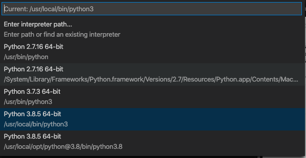



You can set your Python version in VS Code by opening a `.py` script and then clicking on the Python text in the bottom left corner as shown below.


Once you click, VS Code will open the command pallete where you can select your installation of Python that you would like to use with this workspace.



This setting will not fix what version your interactive Python window is using. You can get there by [opening settings](https://code.visualstudio.com/docs/getstarted/settings) by using  the `⌘,` shortcut.

You can then search your settings for _jupyter_ and you should see a section that has `Jupyter Command Line Arguments`.  Click on the `Edit in settings.json`.


Here you can set the jupyter path to Python to match the one you picked for your Terminal. An example for a Mac computer is shown below.

```
		"python.pythonPath": "/usr/local/opt/python/bin/python3",
```







Most likely your Python SSl certificates are not installed.  Follow the answer in [this post](https://stackoverflow.com/questions/50236117/scraping-ssl-certificate-verify-failed-error-for-http-en-wikipedia-org)






[Microsft's Live Share extension documentation](https://code.visualstudio.com/learn/collaboration/live-share) says, _'Live Share enables you to quickly collaborate with a friend, classmate, or professor on the same code without the need to sync code or to configure the same development tools, settings, or environment.'_  You can follow their guide or use our course created video.






