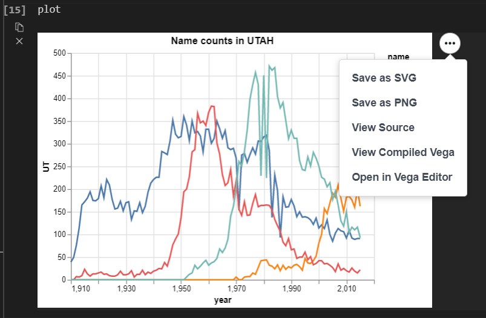

## Altair Visualization

We will be using Altair in our course. It is a declarative visualization package in Python that is based on Vega-Lite which leverages the grammar of graphics.

- [User Guide](https://altair-viz.github.io/)
- [Data Visualization Curriculum](https://uwdata.github.io/visualization-curriculum/intro.html) or the [Quarto version]()
https://jjallaire.github.io/visualization-curriculum/)
- [P4DS Data Visualization Chapter](https://byuidatascience.github.io/python4ds/data-visualisation.html)

## Rendering Altair Charts in Quarto

We use [Quarto](https://quarto.org/docs/presentations/revealjs/#figure-size) to render Altair images automagically into our HTML reports.  The process should simply work.  However, read in the following section if you need to export one of your images as a `.png` or another image format.

## Saving Altair Charts

Just installing `altair` and `altair_saver` will not allow you to leverage the `.save()` method to save your chart. The javascript visualization you see in your interactive python window needs additional external applications to allow `.save('chart.png')` to work.

We will go through a few ways for us to save our Altair plots. 



### 1. Saving `altair` plots programmatically


Let's say we want to save the above plot as a PNG file. Assuming we have already installed the **altair** library, we need to install the **altair_saver**. 

#### 1.1 Installing the altair_saver

Within your interactive python window execute the following command.

```python
import sys
!{sys.executable} -m pip install altair_saver
```

#### 1.2 Additional tool for saving plots

__We suggest NodeJS path.__ However, you are more than welcome to study [Selenium](https://github.com/altair-viz/altair_saver#selenium) for further understanding. The Github repository for [altair_saver](https://github.com/altair-viz/altair_saver), the developers exclusively told us to install additional tools.


__NodeJS Installation__

1. Install the [NodeJS](https://nodejs.org/en/download/) for your platform
2. Run the following in your Terminal (Mac) or PowerShell (Windows) to install all the packages we need from NodeJS.

```
npm install -g vega-lite vega-cli canvas
```

##### M1 Mac Altair Solution

1. Install selenium using the chromedriver package form [this link](https://chromedriver.chromium.org): [https://chromedriver.chromium.org](https://chromedriver.chromium.org). 
2. Unzip the file and move the file to your chrome path `/usr/local/bin/chromedriver`

See the [`selenium_fix.py`](selenium_fix.py) script for an example.

_Note: This process will run a local server on your computer that opens the chart as an PNG file in chrome and downloads the file to the folder in which that VSCode file is located on your computer._


#### 1.3 Saving a plot using `altair_saver`

It might require you to restart VScode and import everything again for this to work. Please note that the plot will be saved in the same folder of the script.

```python
chart = alt.chart(<data>).<chart_methods>
chart.save('name_of_chart.png')
```

### 2. `Save as PNG` method

The method only requires us to have **Altair** library. Whenever we output a plot, we will see a button with three dots at the top right corner of the plot.



Clicking *Save as PNG* will bring us to a window to save our plot.

### 3. Screenshot method

If all thing fails and we need to save a plot, the [snip & sketch (Windows)](https://blogs.windows.com/windowsexperience/2019/04/08/windows-10-tip-snip-sketch/) or taking a [screenshot (MacOS)](https://support.apple.com/en-us/HT201361) will be our last resort.