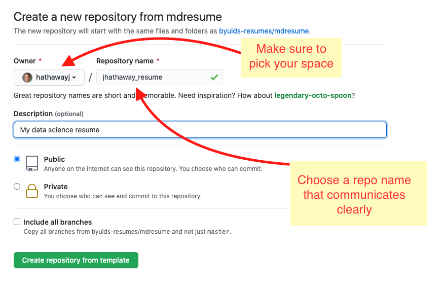
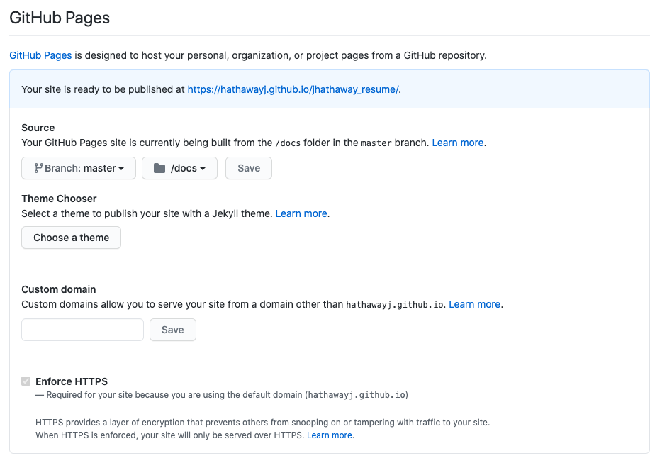
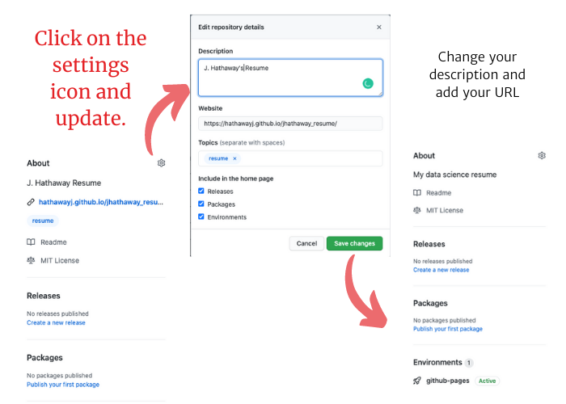

<!-- https://byuidss.herokuapp.com/ -->
<!-- https://byui-dss.herokuapp.com/ -->

## Git what?

Git is a distributed version control tool that can manage a development project's source code history, while GitHub is a cloud based platform built around the Git tool. Git is a tool a developer installs locally on their computer, while GitHub is an online service that stores code pushed to it from computers running the Git tool. The key difference between Git and GitHub is that Git is an open-source tool developers install locally to manage source code, while GitHub is an online service to which developers who use Git can connect and upload or download resources.[^1]

### Git?

The Git tool is popular with developers because is stays true to its purpose of versioning source code, managing commit histories and making it possible to share code between developers without deviating into peripheral fields. There is no feature bloat with Git. It does what it does, it does nothing else, and it makes no apologies for that fact.[^1]

### Github?

We’ve established that Git is a version control system, similar but better than the many alternatives available. So, what makes GitHub so special? Git is a command-line tool, but the center around which all things involving Git revolve is the hub—GitHub.com—where developers store their projects and network with like minded people.[^2]

## Steps related to Git and Github for our final project.

> 1. Make sure you have [git](https://git-scm.com/) on your computer.   
    A. _Note that Mac users have a few extra concerns._[^3]
    B. [Mac fix with paths](https://modulesunraveled.com/installing-git/updating-git-if-you-have-only-version-comes-xcode-or-command-line-developer-tools)  `ls /usr/local`     
    C. [Download Xcode and update](https://developer.apple.com/xcode/) 10 gig download.   
    D. VSCode path selection settings `Git: path`   

> 2. Create a [GitHub account](https://github.com/join) and use [an appropriate username](https://workplace.stackexchange.com/questions/83967/does-my-employer-care-about-my-github-username)

> 3. Connect to our BYU-I organizations.   
    A. [BYU-I DS Resumes](https://github.com/byuids-resumes) _need teacher to admit you_      
    B. [BYU-I Data Science Society](https://github.com/BYUIDSS) _need teacher to admit you_ 
  
> 4.  [Creat your own resume repo](https://github.com/new) from our [template](https://github.com/byuids-resumes/mdresume) (some directions)[https://github.blog/2019-06-06-generate-new-repositories-with-repository-templates/]

> 5. Publish your repo on GitHub pages.   
    A. Go to settings for your repo.   
    B. Scroll down to the _GitHub Pages_ section.   
    C. Under source select the box which says `None` and pick _master_.   
    D. Now select the _/docs_ folder and click save.   

> 6. Check your published site settings and copy your site URL.

> 7. Update your repository landing page to include your pages URL.

> 8. Edit the `readme.md` in the base repo to not show the resume directions if your repo is public.

> 9. Fork your repo back into the [BYU-I DS Resumes](https://github.com/byuids-resumes)

> 10. Merge a pull request with any changes in your personal repository (see [pull and merge on GitHub Guide](../git_github_ds/pull_merge/)).

[^1]: https://www.theserverside.com/video/Git-vs-GitHub-What-is-the-difference-between-them#:~:text=The%20key%20difference%20between%20Git,and%20upload%20or%20download%20resources.
[^2]: https://www.howtogeek.com/180167/htg-explains-what-is-github-and-what-do-geeks-use-it-for/
[^3]: https://stackoverflow.com/questions/29971624/visual-studio-code-cannot-detect-installed-git