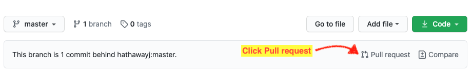
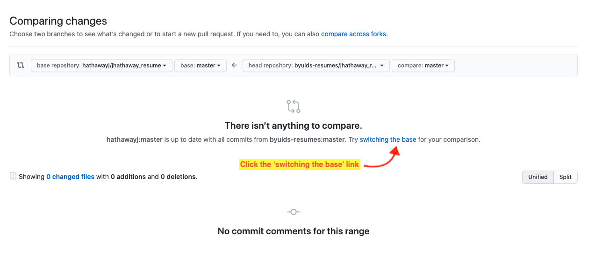
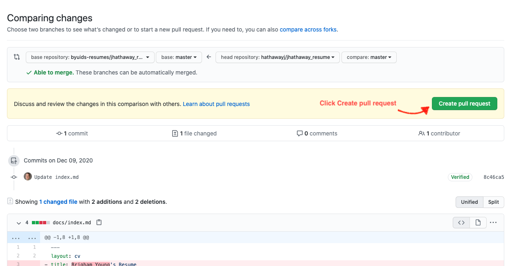
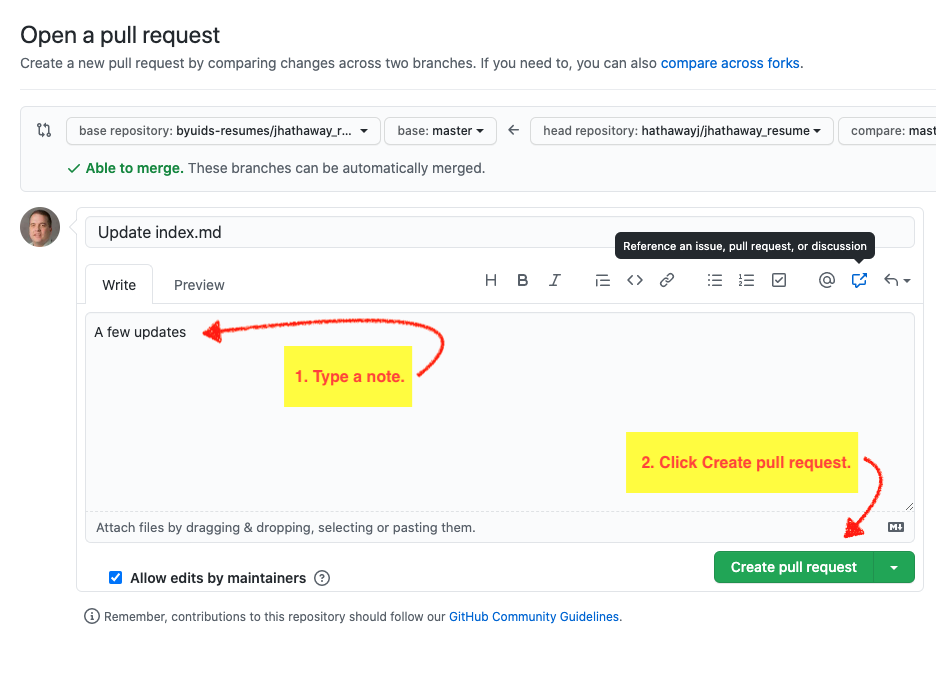
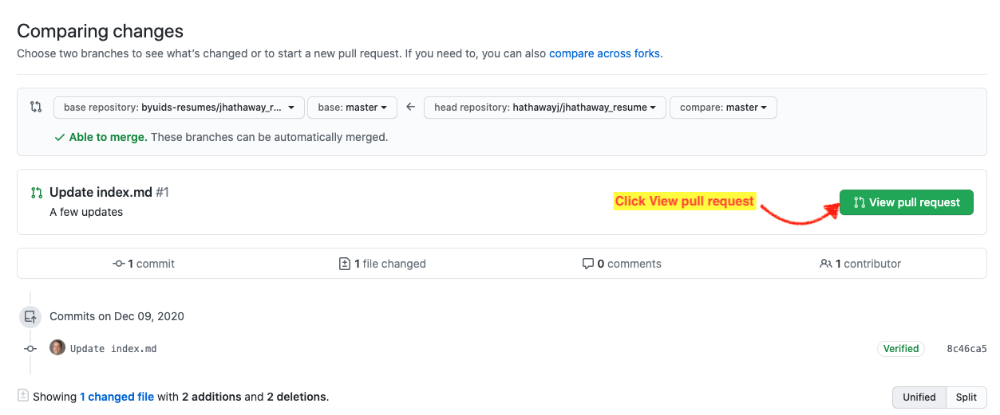
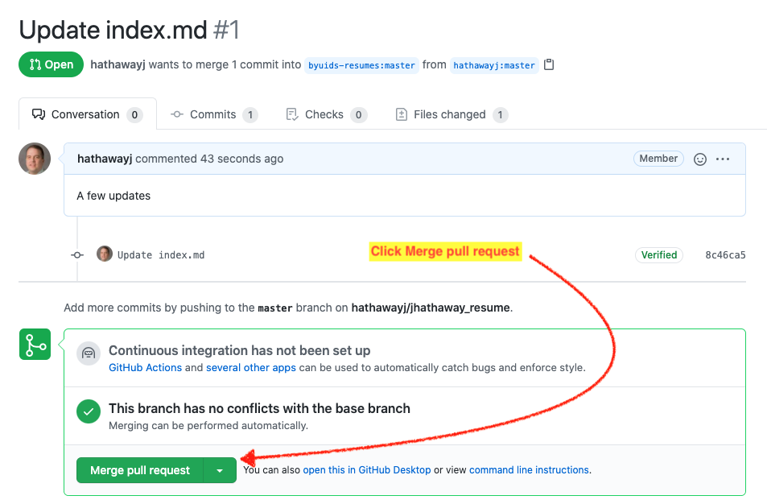
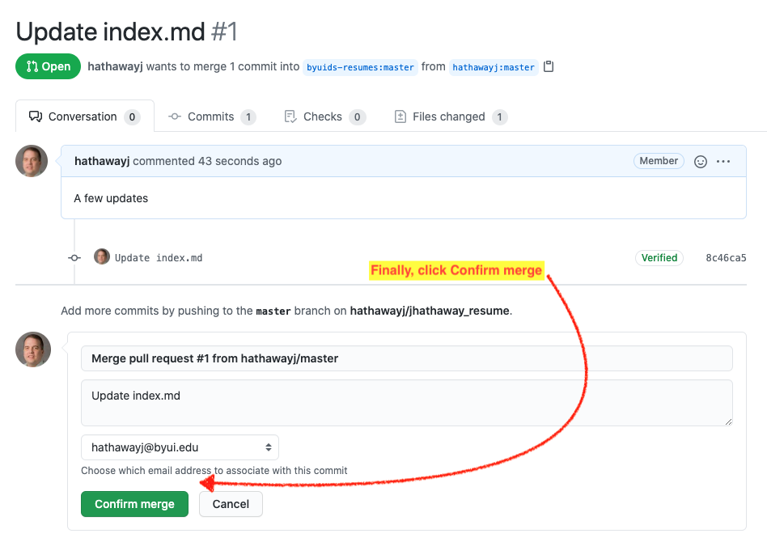

### Create Pull Request

> 1. Go the the forked repository in [byuids-resumes](https://github.com/byuids-resumes) and click _Pull request._

> 2. This will bring you to the the following page where you need to click _switching the base._

> 3. Now you can _Create pull request._

> 4. Here you can type a note and then actually _Create pull request._

> 5. Now you need to _View pull request._

### Merge Request

_If you have admin access of the forked repository where you are doing the pull request, you can finish the next two steps._

> 6. Click the _Merge pull request_ button.

> 7. Now confirm the merge.

