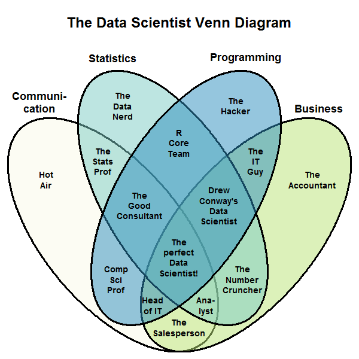
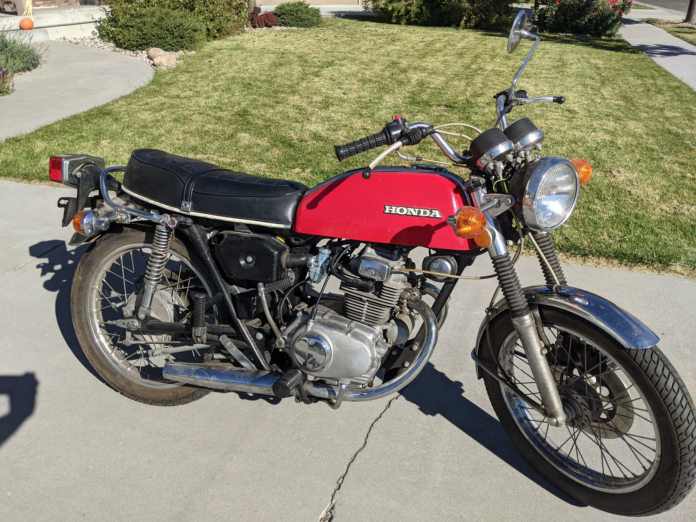
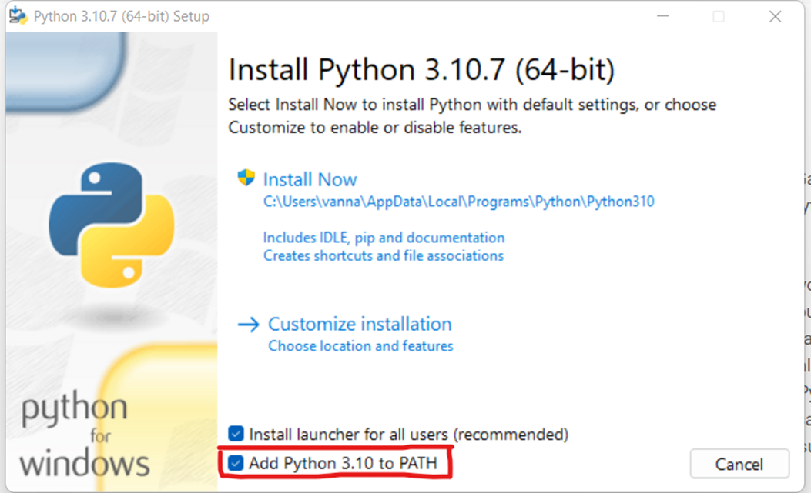

## Welcome to DS 250! 
<!------------------

This is your first programming class that really isn't about programming.  Sure you'll learn how Data Scientists use Python to answer questions with data.
But above all, you'll develop problem solving skills.  This is what distinguishes a great Data Scientist, not the code.  

This class is fundamentally about solving problems.  Solving problems with your computer.  Solving problems with your code.  By the end of this semester
you'll have a ton of experience solving problems.  And even if you go on to never code again, you will have learned how to be better problem solvers.  That'll
stick with you whether you're an accountant or a web designer.  

It's a learned skill.  You have to know where to look, when to ask for help, how to collaborate.  

It's going to suck until you get to the point where you know how to Google things the best way, how to distinguish between helpful and useless info.

## First Problem to Solve:  How do the Arthurian Legends, The Princess and the Frog, and Ruth relate?
1. Define what you mean? Which versions? 

## Second Problem:  Getting Python and the required libraries up and running on your computer.  This sounds simple, but I guarnatee 
every one of you will run into issues.  There're almost as many ways for this to go wrong as there are students.  

## Install latest version of VSCode and Python.  If you're on a PC, delete all the old versions you may have (more difficult for Mac because it comes pre-installed)
## Be sure to click the "Add to Path" option


# This is also not graded like classes you're used to.  This class is a sumulated version of a job as a Data Scientist. Not all of you are Data Scientists in 
training, but this is universal:  Communicating technical results so that non-technical people 

1. Problem Solving
2. Improved coding skills
3. Effective written/visual communication
4. Collaboration
5. Timeliness and communication with the boss


-------------------->

- Teacher: Luc Comeau
- TA: ???

<br>

## Announcements

1. [Computing Lab](https://byuidatascience.github.io/lab/)  4:30PM - 6:30PM all weekdays except Wednesday. Saturday from 10AM-12PM
    * Slack channel #tutoring_lab
1. Data Science Society - Wednesday's at 6PM

## What is a Data Scientist?




## Class Structure
<!------------------

Data Scientists use computers and code to get insight from data.  They aren't usually the best programmers nor the best statisticians.
But they get really good at figuring things out.  

Syllabus:  Activities and grading scale

I spent 15 years working as a stat. and DS.  For a long while I was the only one supporting a global organization.  Every time annual reviews came up
my boss would say, "not sure how to benchmark your."  

Pretty common practice to have a pile of cash to divy up between a team.  Our rankings were relative, meaning exceeds expectations meant did I exceed relative to the 
rest of my team mates.  

I'd be compared with business leads or research scientists to decide what proportion of the pot I deserved.  Not exactly fair.  

This class is different, though.  You all get the same assignments, and I can see who did exceptional work (communications and technical), and who meets exp.  

Open syllabus

-------------------->

1. Problem Solving
2. Improved coding skills
3. Effective written/visual communication
4. Collaboration
5. Timeliness and communication with "the boss"

[Syllabus](https://byuistats.github.io/DS250-Comeau/course-materials/syllabus/)

## Got Slack?

#### Are we all on the Slack channel?

Follow the Slack invitation that is waiting in your student email.

<br>


## Who are you?

<!------------------
# https://www2.byui.edu/Presentations/Transcripts/EducationWeek/2009_07_30_Clark.htm
# https://www2.byui.edu/Presentations/transcripts/devotionals/2009_09_15_clark.htm
-------------------->

1. Introduce yourself and learn the names/majors/origin story of your group members.
1. Make a plan to get help this semester. How will you contact each other? Some ideas: Slack, I-Learn, emails, group texts, etc.
1. If you were independently wealthy, what would you be doing right now?  Would you change majors?
1. Highlights of 2022

## Problem Solving

This is not a "see and repeat" programming class!  

### How would you go about fixing my motorcycle?



#### Learn how to ask for help (1 hr rule)

<br>

***

<br>


## Getting started on Project 0

#### Setting up your Programming Snvironment

1. Download [Visual Studio Code](https://code.visualstudio.com/)
1. Download [Python](https://www.python.org/downloads/) v [(3.10.8)](https://www.python.org/downloads/release/python-3108/)
    * Be sure to select the *"Add to Path"* option during the install process
    * 
1. Install the Python packages and VS Code extensions you need (see [this page](https://byuistats.github.io/DS250-Comeau/course-materials/python-for-data-science/))
1. Install Quarto CLI [Quatro Instructions](https://byuistats.github.io/DS250-Comeau/course-materials/quarto-for-data-science/)
1. Start looking at Project 0
1. Complete the "Methods Checkpoint"

#### Installing Packages and Extensions

Learn how to install packages by reading the assigned material and by watching the video tutorial on [this page](https://byuistats.github.io/DS250-Comeau/course-materials/python-for-data-science/).

The readings mention a lot of different packages. For Project 0, you need to install at least `pandas`, `altair`, `numpy`, and `jupyter`.

The readings will also mention two VS Code extensions you need to install.

#### A note on Jupyter Notebooks vs. Interactive Python Window

The textbook will show you how to use VS Code's interactive python windows and Quatro. **Feel free to use Jupyter Notebooks.**  
We will do write-ups in Quarto, though, which can be rendered as a PDF or HTML


<!---------------------------------
#### Setting up your `py` script

Create a new file in VS Code with a `.py` file extension. This is your Python script.

A good data science `.py` script will have packages and data loaded at the top. Usually you have a few short commented sentences that describe the script purpose. An example is below.

   ```python
   # %%
   # import pandas, altair, numpy
   import pandas as pd
   import altair as alt
   import numpy as np

   # %%
   # load data
   url = 'https://github.com/byuidatascience/data4soils/raw/master/data-raw/cfbp_handgrenade/cfbp_handgrenade.csv'
   dat = pd.read_csv(url)
   ```
If you installed the `jupyter` package, then your Python interactive window should work. ([Section 1.4.2.2](https://byuidatascience.github.io/python4ds/introduction.html#visual-studio-code-vs-code)) This means that when you type `#%%` at the top of your code, you should see a little button pop up that says "run cell". This will run your Python code in an interactive window (on the right side of VS Code) instead of in the terminal (at the bottom of VS Code).
   
Your code for the introduction project will come straight from the reading material. If you have the `pandas` and `altair` packages, you should be able to make the first chart in [P4DS section 3.2.2](https://byuidatascience.github.io/python4ds/data-visualisation.html#creating-an-altair-plot). 

Note that you must add a line of code that says `chart` in order to print out the Altair image you created.
--------------------------------------->


<!-----------------------------------------

## Welcome to DS 250!



## What do you want to know?


<br>







Brother Hathaway's definition:

>A blend of programmer, statistician, and communicator that burns with curiosity.

My definiton for DS 250:

>Someone who can extract insights from data and then communicate those insights with clarity.


<br>

**Learn more about the BYU-Idaho data science program [here](http://www.byui.edu/mathematics/data-science).**






__Data scientists write code as a means to an end, whereas software developers write code to build things.__  Data science is inherently different from software development in that data science is an analytic activity, whereas software development has much more in common with traditional engineering.  

Data scientists tackle problems such as identifying fraudulent transactions, or predicting which employees are likely to leave a company.  Software developers can take the data scientists models and turn them into fully functioning systems with production-quality code.  Software developers tackle problems like getting an algorithm to run more efficiently, or building user interfaces. 





Upon completing this course, you will be able to use data-driven programming in __Python__ to handle, format, and visualize data. We will introduce you to data wrangling techniques (__panadas__), analytical methods (__scikit-learn__), and the grammar of graphics (__Altair__). Specifically, as a successful learner, you will be able to:

1. Use functions, data structures, and other programming constructs efficiently to process and find meaning in data.
2. Programmatically load data from various types of data sources, including files, databases, and remote services.
3. Use data manipulation libraries to perform straightforward analysis, produce charts, and prepare data for machine learning algorithms.
4. Use machine learning libraries to discover insights, make predictions, and interpret the success of these algorithms.
5. Collaborate and share your work with industry-leading tools.





> Brigham Young University-Idaho was founded and is supported and guided by The Church of Jesus Christ of Latter-day Saints. Its mission is to develop disciples of Jesus Christ who are leaders in their homes, the Church, and their communities.

- How would you describe a leader?
- What makes a leader powerful?
- What does a leader do with insights?

[An example of a good leader.](https://www.churchofjesuschrist.org/study/scriptures/pgp/js-h/1.p1#p1 )

[What (or who) is truth?](https://www.churchofjesuschrist.org/study/scriptures/nt/john/14.6?lang=eng#p6#6)




<br>

## Course Format and Grading



__The reality of CSE 250:__

1. We have done all we can to ensure that this is a 2-credit course for the average student.  That means that we expect 4-6 hours outside of class for the average student to achieve an A.  You have to put in the time if you want to build skills.
2. __The course is necessarily creative in nature.__ That fact usually makes it feel more challenging. We will be asking you to learn to write _creative_ data science python code.
4. __If you have any concerns, please talk with me!__





The class uses 7 projects to teach data science programming in Python using [pandas](https://pandas.pydata.org/), [Altair](https://altair-viz.github.io/), [scikit-learn](https://scikit-learn.org/stable/), and [numpy](https://numpy.org/).

- [Projects](../../../projects)
- [Syllabus](../../../course-materials/syllabus)






- [Specification Grading](../../../course-materials/syllabus/#spec)
- [Grading structure](../../../course-materials/syllabus/#scale)
- [Competency Elements](../../../course-materials/syllabus/#elements)

<br>

## Introduction Project
------------------------------------------------------------>


<!-------------------------------------------------------------------------


Completing the introduction project will set you up for success the rest of the semester. The workflow followed in the introduction project (loading packages, writing code, saving images, compiling a final report) will be the same for every other project . __If you have questions about this project, you need to seek help.__





Make sure you carefully read the [project instructions](../../../projects/introduction/).

You will submit a single `.pdf` file to I-Learn. This pdf file should contain an project summary, your answers to the grand questions (including the plot you saved with `altair_saver`), and an appendix where you copy and paste your commented Python code.


-------------------------------------------------------->


<!-------------------------------------
### Install Packages

Learn how to install packages by reading the assigned material and by watching the video tutorial on [this page](../../../course-materials/python-for-data-science/).

You need to install `pandas`, `altiar`, `numpy`, `scikit-learn`. 

To get Python interactive window working, you also need to install the `jupyter` package.

<br>

### Setting up your `py` script

Create a new file in VS Code with a `.py` file extension. This is your Python script.

A good data science `.py` script will have packages and data loaded at the top. Usually you have a few short commented sentences that describe the script purpose. An example is below.

   ```python
   # %%
   # import pandas, altair, numpy
   import pandas as pd
   import altair as alt
   import numpy as np

   # %%
   # load data
   url = 'https://github.com/byuidatascience/data4soils/raw/master/data-raw/cfbp_handgrenade/cfbp_handgrenade.csv'
   dat = pd.read_csv(url)
   ```
If you installed the `jupyter` package, then your Python interactive window should work. ([Section 1.4.2.2](https://byuidatascience.github.io/python4ds/introduction.html#visual-studio-code-vs-code)) This means that when you type `#%%` at the top of your code, you should see a little button pop up that says "run cell". This will run your Python code in an interactive window (on the right side of VS Code) instead of in the terminal (at the bottom of VS Code).
   
Your code for the introduction project will come straight from the reading material. If you have the `pandas` and `altair` packages, you should be able to make the first chart in [P4DS section 3.2.2](https://byuidatascience.github.io/python4ds/data-visualisation.html#creating-an-altair-plot). 

Note that you must add a line of code that says `chart` in order to print out the Altair image you created.


----------------------------------------------->


<!---------------------------------
### Save the Altair Plot

Now that you've made the Altair chart from [P4DS section 3.2.2](https://byuidatascience.github.io/python4ds/data-visualisation.html#creating-an-altair-plot), the next step is to save the chart as a `.png` file. 

To do this, you need to:
  - install the `altair_saver` package
  - install [NodeJS](https://nodejs.org/en/download/package-manager/)
  - Run `npm install -g vega-lite vega-cli canvas` in your terminal/command prompt to install NodeJS dependencies

The `altair_saver` package can be troublesome. For help:
  - watch the video tutorial on [this page](../../../course-materials/altair/)
  - Try reading through the [altair_saver documentation](https://github.com/altair-viz/altair_saver)

### Final Report

At this point you should have Python and VS Code working, created the Altair chart from the reading material, and saved the chart as a `.png` file.

The final step is to put your code and image into a markdown report. (The template is in the [project instructions](../../../projects/introduction/).) The markdown report should be converted to a pdf before being submitted to I-Learn.

Watch this [video tutorial](../../../course-materials/markdown/) to see an example of creating a final report.
----------------------------------------->

<br>
