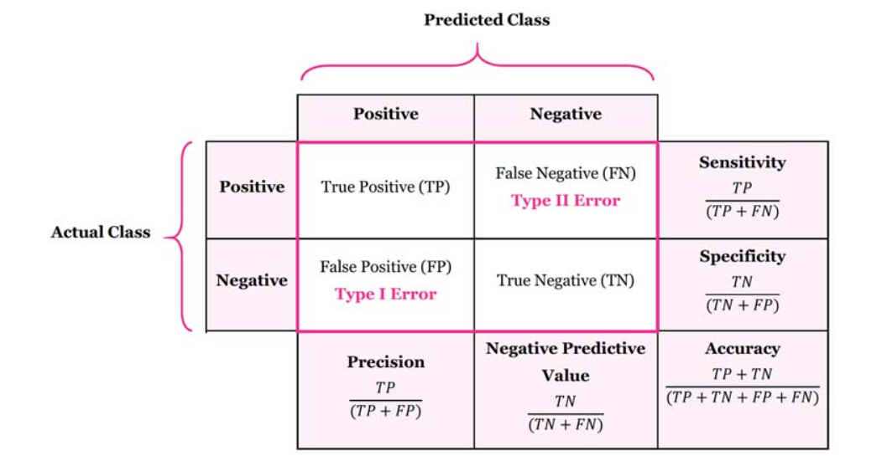

# Announcements

## Today:

1. Continue discussion about evaluating models
2. Try to understand what are models are doing

## Evaluating model performance cont

#### Confusion Matrix

##### Why isn't accuracy enough?

A confusion matrix is a quick way to see the strengths and weaknesses of your model. __A confusion matrix is not a "metric".__ A confusion matrix provides an easy way to calculate multiple metrics such as accuracy, precision, and recall.




<br>

#### Your Turn

**With your group, use the links above to find a definition for your assigned metric. Then try using the confusion matrix on the screen to calculate your metric for my model.**

- ~~Group 1: Accuracy~~
- Group 2: Sensitivity/Recall 
- Group 3: Precision
- Group 4: Specificity
- Group 5: F1 Score
- ~~Group 6: Balanced Accuracy~~

#### Validation metrics

> - [How to choose a good evaluation metric for your Machine learning model](https://ranvir.xyz/blog/how-to-evaluate-your-machine-learning-model-like-a-pro-metrics/)  
> - [Confustion Matrix Example](https://www.dataschool.io/simple-guide-to-confusion-matrix-terminology/)
)
> - [Classification Metrics in scikit-learn](https://scikit-learn.org/stable/modules/model_evaluation.html#classification-metrics)


<br>

```python
#%%
# a confusion matrix
print(metrics.confusion_matrix(y_test, y_predicted_DT))

#%%
# this one might be easier to read
print(pd.crosstab(y_test.before1980, y_predicted_DT, rownames=['True'], colnames=['Predicted'], margins=True))

#%%
# visualize a confusion matrix
# requires '.' to be installed
metrics.plot_confusion_matrix(classifier_DT, x_test, y_test)
```

<br>


#### Some python code

```python
# Which metric seems better `accuracy_score()` or `balanced_accuracy_score()`? Why?
print("Accuracy:", metrics.accuracy_score(y_test, y_predicted_DT))
print("Balanced Accuracy:", metrics.balanced_accuracy_score(y_test, y_predicted_DT))

# Confusion matrix
print(pd.crosstab(y_test.before1980, y_predicted_DT, rownames=['True'], colnames=['Predicted'], margins=True))
metrics.plot_confusion_matrix(classifier_DT, x_test, y_test)

# Other metrics
print(metrics.classification_report(y_test, y_predicted_DT))
```
<!------------------
## Plotting feature importance

__What do we need from our model to create this plot?__


[ref](https://scikit-learn.org/dev/auto_examples/inspection/plot_permutation_importance.html)
-------------------->

<br>

## Improving your fit

#### Using different features

**Let's add Neighborhood to our previous work.**

The `dwellings_neighborhoods_ml` data set contains the neighborhood variable "`nbhd`" from the original data transformed to use one hot encoding. ([Image source.](https://www.kaggle.com/dansbecker/using-categorical-data-with-one-hot-encoding))


If we want to use neighborhoods in our classifier, we need to join `dwellings_neighborhoods_ml` with the other features we've been using.

```python
#  what we used last class
x = dwellings_ml.filter(["livearea","basement","stories","numbaths"])
y = dwellings_ml[["before1980"]]

# adding on the neighborhood data
x2 = x.join(dwellings_neighborhoods, how='left')
```

<br>

## Picking a different model

#### Gradient Boosting Classifier

> - [A Gentle Introduction to the Gradient Boosting](https://machinelearningmastery.com/gentle-introduction-gradient-boosting-algorithm-machine-learning/)
> - GradientBoostingClassifier [documentation](https://scikit-learn.org/stable/modules/generated/sklearn.ensemble.GradientBoostingClassifier.html)
> - [Gradient boosting](https://en.wikipedia.org/wiki/Gradient_boosting) wikipedia page


```python
from sklearn.ensemble import GradientBoostingClassifier

boost = GradientBoostingClassifier(random_state=42)
boost.fit(x_train, y_train)
```

<br>

#### Category Boosting (catboost)

> - [Video: What is Category Boosting (catboost)?](https://www.youtube.com/embed/s8Q_orF4tcI)
> - CatBoostClassifier [documentation](https://catboost.ai/docs/concepts/python-quickstart.html#classification)


```python
import catboost as cb
model = cb.CatBoostClassifier(iterations=10,
                           depth=6,
                           learning_rate=1,
                           loss_function='Logloss',
                           verbose=False)
model.fit(x_train, y_train)
```
