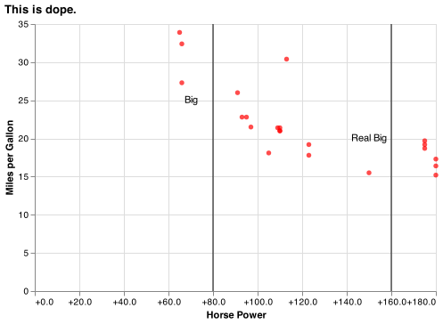

## Coding Challenge Example

The final coding challenge will be about as difficult as what is shown below.  Remember, you will only have 60 minutes! You will not be able to answer all the questions perfectly, but you should attempt to answer each one.

Your answers will go in a markdown template that I provide the day of the challenge (very similar to the project template). The markdown template and your python file need to be submitted in I-Learn *before* class ends.

<br>

### Practice Challenge

```python

import pandas as pd
import altair as alt
import numpy as np

dat = pd.read_csv('https://github.com/byuidatascience/data4missing/raw/master/data-raw/mtcars_missing/mtcars_missing.csv')

```

**1. Try recreating this chart using the [mtcars missing](https://github.com/byuidatascience/data4missing/raw/master/data-raw/mtcars_missing/mtcars_missing.csv).**

- Note that `hp` has missing values, and you will have to replace them with the mean.
- Please drop all cars with a missing name.



<br>

**2. Try writing code to recreate the following table.**

- Have `cyl` on the rows and `carb` on the columns
- Each value shows the counts of each.
- Hint: The [pivot_table](https://pandas.pydata.org/pandas-docs/stable/reference/api/pandas.pivot_table.html#pandas.pivot_table) function could prove valuable as well as [groupby](https://pandas.pydata.org/pandas-docs/stable/reference/api/pandas.DataFrame.groupby.html) and [agg](https://pandas.pydata.org/pandas-docs/stable/reference/api/pandas.DataFrame.agg.html).


|   cyl |   1 |   2 |   3 |   4 |   6 |   8 |
|------:|----:|----:|----:|----:|----:|----:|
|     4 |   5 |   4 |   0 |   0 |   0 |   0 |
|     6 |   2 |   0 |   0 |   4 |   1 |   0 |
|     8 |   0 |   3 |   3 |   5 |   0 |   1 |

<br>

**3. I will also ask you to fit a Machine Learning Model.**

- To practice for this question, I would recommend reviewing your work from previous projects.
