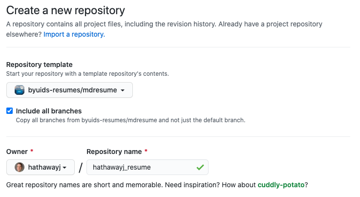

## Welcome to class!

#### Spiritual Thought
#### Announcements
1. Project 5 Comment
    * Feature Importance and Model discussion
2. The last day of DSS is next Wednesday, Mar 29th at 6:00PM in STC 394
3. Extra credit for creating and uploading cheat sheet (2 points for projects or checkpoints)
4. Coding Challenge date?  

1. The technical aspects of Project 6 will be done mostly in class. Resume prep/MD outside

<!----------------------
## Syllabus Review

- **Projects:** I try to leave detailed feedback when I grade your projects. You can update your projects and resubmit to increase your score.
- **Mid-project quizzes and methods quizzes:** The syllabus requires a certain number of quizzes to be compete at 100%. If you missed a quiz and got locked out, message Sister Larson.
- **Data science community :** Haven't attended the Data Science Society yet? The best day to visit is Wednesday, March 31st, at 6 pm. The zoom link will be posted in the #general slack channel. This is the day when the teams present the work they've done over the semester.
- **Coding Challenge:** The coding challenge will be held on the last day of class, April 5th, from 10:15 to 11:15.We will do a practice challenge sometime next week.
------------------->

 

## Git and GitHub

###  "Web developers' social media platform"

>This is GitHub, the world’s largest code repository platform online. A platform used by some 50 million software developers to host their coding projects, most of them open-source — meaning others can access their codes and modify them to create better versions if they feel like.
>
>  
>
>Most of the internet is produced or hosted on GitHub in the form of code. “What Gmail is to email, GitHub is to writing software,” says Kiran Jonnalagadda, cofounder of HasGeek, a platform to build and discover peer groups. [*Source*](https://economictimes.indiatimes.com/internet/inside-github-web-developers-social-media-platform/articleshow/77096752.cms?utm_source=contentofinterest&utm_medium=text&utm_campaign=cppst)

- **Don't:** post code for assignments that hundreds of other students have done.
- **Do:** post unique code using skills from your classes.

I would also recommend using private repos to manage your course work.

 

### Is it going to hurt?

__Answer: Yes.__

It feels weird at first but quickly becomes second nature. If you plan on taking more data science classes, you should know that DS 350 students are required to submit all coursework via GitHub. This is a major topic in class and office hours for the first two weeks. Then we practically never discuss it again.

More bad news. Do you use GitHub to work with other people or to coordinate your own work from multiple computers? If so, after you recover from the initial setup, Git will crush you again with merge conflicts. And this is not one-time pain, this could be a dull ache for a long time.
<!----The best remedy is prevention, but also understanding how to back out of tricky situations and tackle them on your own terms.---->

> Managing a project via Git/GitHub is much like the Google Doc scenario and enjoys many of the same advantages. It is definitely more complicated than collaborating on a Google Doc, but this puts you in the right mindset. [*Source*](https://happygitwithr.com/big-picture.html)

 

### Step 1: Download and install

Follow steps 1-4 of [this tutorial](https://www.jcchouinard.com/install-git-in-vscode/). 

Then:
1. Request access tothe BYU-I Resumes page at [Request Access](https://byui-dss.herokuapp.com/)
2. Respond to the auto-generated email
3. Wait a few minutes for authorization
4. Join our GitHub organization - [byuids-resumes](https://github.com/byuids-resumes).

 

##### If you are on a Mac, you may need:

- [Mac fix with paths](https://modulesunraveled.com/installing-git/updating-git-if-you-have-only-version-comes-xcode-or-command-line-developer-tools)
- [Download Xcode and update](https://developer.apple.com/xcode/) (10 gig download)
- [VSCode path selection](../../../course-materials/git_github_ds/) (scroll down to step 1)

 

### Step 2: Create a repository from the resume template and connect to the BYUI

 

### Step 3: Publish your resume to GitHub Pages

- Go to settings for your repo.
- Scroll down to the GitHub Pages section.
- Under source select the box which says None and pick master.
- Now select the /docs folder and click save.
- Copy your site URL at the top of the /settings/pages location.
- Add your link to the About section of your repository.
- Edit the readme.md in the base repo to not show the resume directions.

 

### Step 4: Clone repo into VS Code

[Analytics Vidhya reading](https://www.analyticsvidhya.com/blog/2020/05/git-github-essential-guide-beginners/)

 

### Step 5: Make your resume look good

Examples:

- [Undergraduate DS resumes](https://byuidatascience.github.io/resume_example.html)   
- [Hathaway's resume](http://jhathaway.io/extra/hathaway.pdf)   

You may also find these articles helpful:

- [How to Write a Great Data Science Resume](https://www.dataquest.io/blog/how-data-science-resume-cv/)
- [How to Build an Effective Data Science Resume](https://www.analyticsvidhya.com/blog/2019/07/how-to-build-effective-data-science-resume-4-key-aspects)
- [How to Write the Perfect Data Scientist Resume](https://elitedatascience.com/resume-tips)
