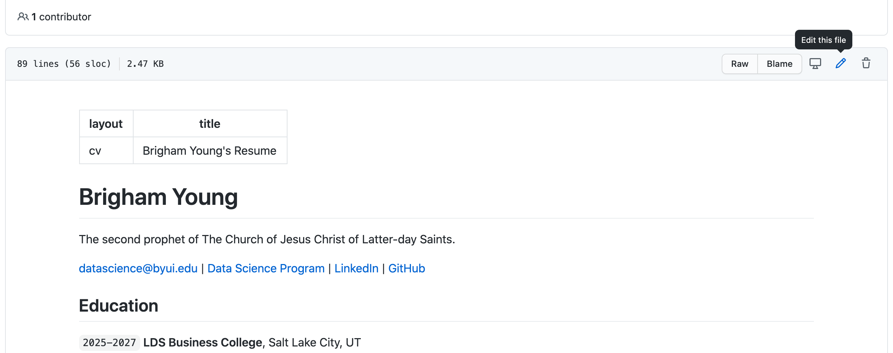

## Welcome to class!
#### Announcements

 

## Practice with Git

#### GQ3: `add, commit, push` and a little `pull`

Let's save the changes we've made to our resume.

 

#### GQ4: Fork and merge

Get into groups of 2 or 3. Then follow the steps below:

1. `fork` the other student's resume repository.
2. Now clone that forked repository to your computer.
3. On your local version of the forked repository, do the following:   
   A. Create a new file called `feedback.md`
   B. Make a few recommendations or notes in the `feedback.md` file that will help the other student improve his or her resume   
   C. `add, commit, push` your edits   
   D. Go to the forked repo on GitHub and check if the `feedback.md` file shows up online   
4. Now, create a `pull request` to get your edits into the other student's original repo.

Once you've given another student feedback, accept any pull requests submitted to your own repo. Continue to edit and improve your resume based on the feedback you received.

 

#### GQ5: Fork into [byuids-resumes](https://github.com/byuids-resumes)

Fork your own resume repository into the [BYU-I Data Science Resumes](https://github.com/byuids-resumes) group.

If you change your resume after you create this fork, you will have to submit a pull request to make sure the final version of your resume shows up in the group.

[These instructions](../../../course-materials/git_github_ds/pull_merge/) will help you create a pull request.

<!---------------------------------------
1. Let's start by editing our `index.md` file on Github. Simply go to `docs/index.md` and fix the name and Education portion in Github

2. After you make your edits, then use the web UI to commit them.

3. Now, we have a different version on GitHub than we do on our local repository. We need to `git pull`

4. Instead of working on GitHub, let's use VSCode to make additional edits to our resume.

5. Once you have some edits done, let's sync them with GitHub. We can use commands or VSCode.   

   A. ` git add --all`: Is telling git that which files you want to store in this _'memory'_.   
   B. ` git commit -m 'my message'`: Is telling git to label all the files that have been added with the message and prep them for _'lift-off'_.   
   C. `git push`: sends the files to the cloud.   

__That is the flow!__

 

## Creating a fork on [byuids-resumes](https://github.com/byuids-resumes)

------------------->

 

